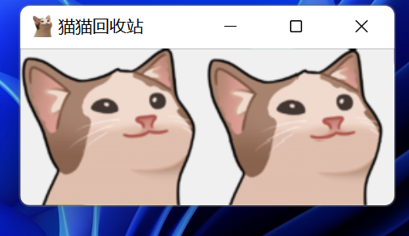
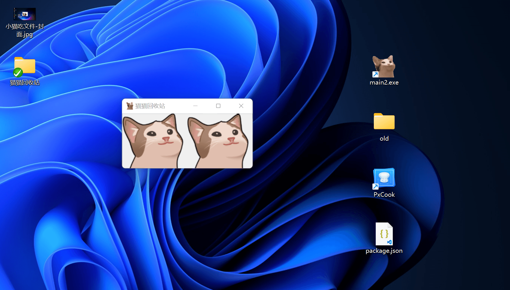

# 猫猫回收站 懒人版



## 效果:





> **优点**:无需修改回收站图标,就可以体验,python也能跨平台。
>
> **windows版本**:可以直接下载:[下载地址](https://wmaxx.lanzoul.com/inJCV05h5kxg) （安装后无法运行请信任此程序）
>
> **mac:** m1 好像安装不了wxpython,暂时做不到

​	

## 详细信息

> 开发语言: `python3`
>
> 核心库:`send2trash(回收)`,`WXpython(GUI)`
>
> 开发环境:`windows`


## 安装


```shell
# 设置国内镜像 可选
pip3 config set global.index-url https://mirrors.ustc.edu.cn/pypi/web/simple
# 安装依赖
pip3 install wxPytho

pip3 install send2trash

pip3 install time

```


## 运行


```python
 
   python main.py

```

## 

